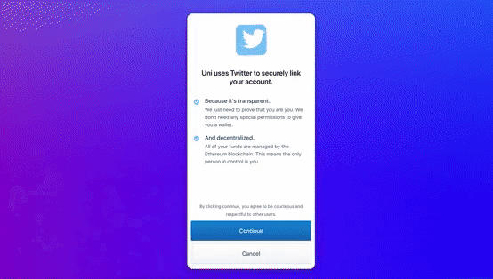

# react-progressive-pane
⚛️  A mobile experience on the web, and a mobile experience on a mobile, although it's basically just a centered `<div />`.

<p align="center">
  
</p>

## 🚀 Getting Started

Using [**yarn**]():

```
yarn add react-progressive-pane
```

Using [**npm**]():

```
npm i -s react-progressive-pane
```

## ✍️ Example

```javascript
import React, { useCallback } from "react";
import { ProgressivePane } from "react-progressive-pane";

export default () => {
  const renderBackdrop = useCallback(
    () => (
      <div
        style={{
          display: "flex",
          backgroundColor: "red",
        }}
      />
    ),
    [],
  );
  const renderContent = useCallback(
    ({ isMobile }) => (
      <div
        style={{
          display: "flex",
          flex: 1,
          backgroundColor: isMobile ? "green" : "red"
        }}
      />
    ),
    [],
  );
  return (
    <ProgressivePane
      renderBackdrop={renderBackdrop}
      renderContent={renderContent}
    />
  );
};
```

## ✌️ License
[**MIT**](./LICENSE)
